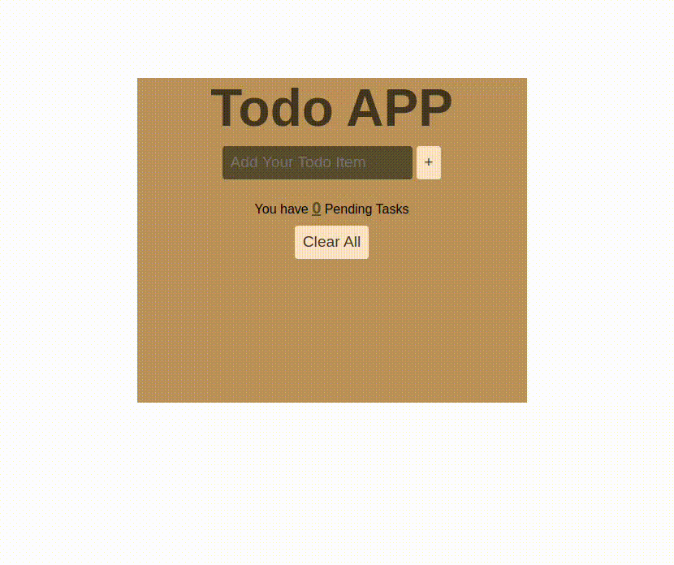

# To-DO App

## Features
- Adding Tasks into List
- Show Pending Tasks
- Delete Individual Tasks
- CLear All Tasks
- Store Tasks into Local Storage
- Cannot Add empty tasks

## What I have Learnt
- use of local storage
- css update using javscript
- how to strategically think while creating such apps

## OutPut

*Time took around 5 hours (pretty slow but learnt a lot)*